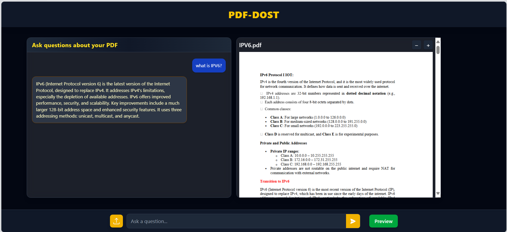
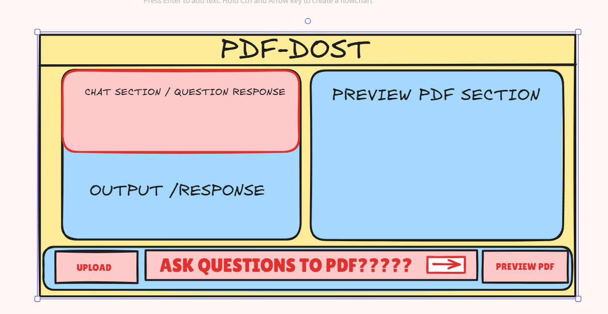

# PDF-DOST

An interactive PDF web assistant that lets you upload a PDF, ask natural-language questions about its contents, and instantly preview and chat with your files—all in a modern, responsive UI.

---
## 🖼️ Screenshots.

### Main UI
  
> _Modern, focused split-view with chat and interactive PDF preview_

### Structure Diagram



## Features 

> - **Easy PDF Upload** — Drag and drop or use the upload button to select any PDF.
> - **Instant Preview** — View your PDF directly inside the app with efficient, adjustable zoom.
> - **Smart Chat** — Ask questions about your PDF (summaries, explanations, sections, etc.) via a sleek,  fast chat interface.
> - **Preview Toggle** — Show/hide PDF for more focus on chat.
> - **Filename Display** — See which PDF is open at a glance.

---
## Tech Stack

- **Frontend:** React, Tailwind CSS, react-pdf, Heroicons
- **Backend:** Python (Flask), PDF processing, NLP/QA logic
- **Other:** Modern dark UI, drag-and-drop, RESTful APIs


- **credits:** - [react-pdf](https://github.com/wojtekmaj/react-pdf) and [Heroicons](https://heroicons.com/) helped me build the project efficently.

---

## 📦 Project Structure

```
frontend/
├── src/
│   ├── components/
│   │   ├── Navbar.jsx
│   │   ├── ChatMessage.jsx
│   │   ├── PreviewPdf.jsx
│   │   ├── Action.jsx
│   │   └── sub_components/
│   │       ├── ChatHeader.jsx
│   │       ├── ChatOutput.jsx
│   │       ├── Upload.jsx
│   │       ├── Chat.jsx
│   │       └── Preview.jsx
│   ├── pages/
│   │   └── Heros.jsx
│   └── services/
│       └── api.js
```
```
backend/
├── static/
│   └── uploads/
│       └── Your PDF uploads will save here.
├── utils/
│   ├── __pycache__/
│   ├── embedder.py
│   ├── llm_helper.py
│   ├── retriever.py
│   └── text_splitter.py
├── venv/                # ...private virtual environment
├── .env
├── .gitignore
├── app.py               # ...main routes
├── check_model.py
├── qa_engine.py
└── requirements.txt

```


## Thankyou 
If you want to improve this project — feel free to fork it and open a pull request!
